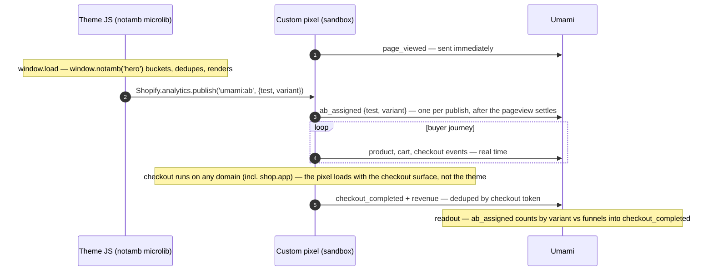

# umami-shopify

[Umami](https://umami.is) analytics for Shopify, as a single copy-paste [custom web pixel](https://help.shopify.com/en/manual/promoting-marketing/pixels/custom-pixels). No app install, no theme edits, no `<script>` tag. Works with Umami Cloud and self-hosted Umami.

The pixel subscribes to Shopify's standard customer events and forwards them to Umami's [send API](https://umami.is/docs/api/sending-stats) — pageviews across storefront **and checkout**, plus commerce events with revenue.

## Install

1. Grab your website ID from Umami (Settings → Websites → Edit → Website ID).
2. In Shopify admin: **Settings → Customer events → Add custom pixel**. Name it `umami`.
3. Paste the contents of [`umami-pixel.js`](umami-pixel.js) into the code box.
4. Edit the two constants at the top:
   - `UMAMI_WEBSITE_ID` — your website ID.
   - `UMAMI_HOST` — leave as `https://cloud.umami.is`, or your self-hosted/proxy URL.
5. Set **Customer privacy** permissions to fit your consent setup (Umami is cookieless; `Not required` is defensible in most setups, but that call is yours).
6. **Save**, then **Connect**.

Visit your storefront and watch events land in Umami's realtime view.

## Configuration

Shopify custom pixels have **no settings UI and no variable substitution** — the pixel manager gives app pixels a `settings` object, but custom pixels explicitly don't get one. The two constants at the top of the file are the entire config surface; everything else is derived from the event context Shopify passes into the sandbox.

The sandbox is a cross-origin iframe, so `window.location` is useless in it. The pixel reads the real page URL, title, referrer, language, and screen size from each event's `context` snapshot instead.

## Events

Only data derivable from Shopify's standard pixel events is sent — no DOM scraping or scroll tracking (the sandbox can't do that anyway).

| Shopify event | Umami | Data |
|---|---|---|
| `page_viewed` | pageview | url, title, referrer, screen, language |
| `product_viewed` | event | product, variant, sku, price, currency |
| `collection_viewed` | event | collection |
| `search_submitted` | event | query |
| `cart_viewed` | event | value, currency, items |
| `product_added_to_cart` | event | product, variant, sku, price, currency, quantity, value |
| `product_removed_from_cart` | event | product, variant, sku, price, currency, quantity, value |
| `checkout_started` | event | value, currency, items |
| `checkout_contact_info_submitted` | event | value, currency, items |
| `checkout_address_info_submitted` | event | value, currency, items |
| `checkout_shipping_info_submitted` | event | value, currency, items |
| `payment_info_submitted` | event | value, currency, items |
| `checkout_completed` | event | **revenue**, **currency**, items, order |
| `ab_assigned` (from `umami:ab`) | event | test, variant |
| your `CUSTOM_EVENTS` | event | the published `customData` |

`checkout_completed` sends `revenue` + `currency`, the property names Umami's [revenue report](https://umami.is/docs/reports) reads. It's also deduped via `localStorage` on the checkout token, since the thank-you page can replay the event on refresh.

## A/B testing

The pixel can't run your test — the sandbox has no DOM access — so bucketing, rendering, *and dedupe* live in your theme JS. The pixel is a passthrough with one integration point: publish an exposure whenever you want one counted.

```js
Shopify.analytics.publish('umami:ab', { test: 'hero', variant: '1' });
```

Every publish becomes one `ab_assigned` event (`{test: 'hero', variant: '1'}`), verbatim — the pixel never dedupes or synthesizes exposures. All events ship in real time; the one ordering rule is that `ab_assigned` waits for the pageview's request to settle, so exposures always land after `page_viewed` (assignment typically happens around `window.load`, well after the pageview fires).

The lifecycle, assuming a small bucketing helper in the theme (here `window.notamb('hero')`: buckets, dedupes at the window level, returns `0` or `1` for the theme to render against, publishes):



Late-activating tests (exit-intent modals, async tooling) need no special casing — publish at activation and the exposure fires then. `umami:ab` is reserved for this — don't add it to `CUSTOM_EVENTS`.

One cross-domain note: when Shop Pay hosts checkout on `shop.app`, the pixel still fires (it loads with the checkout surface, not your theme), so checkout and revenue events keep flowing. Your theme — and therefore `umami:ab` — doesn't run there, which is fine: exposure already happened on the storefront.

**Dedupe when analyzing**: count unique *visitors* on `ab_assigned`, not raw events. Umami dedupes visitors server-side, so a new tab re-firing the exposure doesn't skew the split. Window-scoped exposure also matches Umami's daily-rotating visitor identity — a returning visitor counts as a fresh exposure the same way they count as a fresh visitor.

### Custom events

For anything else (funnel steps, CTA clicks), publish from theme JS or a theme app extension:

```js
Shopify.analytics.publish('mystore:cta_clicked', { placement: 'hero' });
```

and add the name to `CUSTOM_EVENTS` in the pixel:

```js
const CUSTOM_EVENTS = ['mystore:cta_clicked'];
```

The prefix is stripped (`cta_clicked` in Umami) and `customData` becomes the event data. These are *not* deduped — repeats are real actions. The allowlist is deliberate: any visitor can publish custom events from their browser console, so the pixel only forwards names you've opted into. Checkout UI extensions can publish too (`shopify.analytics.publish`) if you need custom events inside checkout.

## First-party proxy (optional)

Ad blockers block `cloud.umami.is` at the DNS level. To make collection first-party, put a passthrough proxy on a subdomain you control and point `UMAMI_HOST` at it:

1. Deploy [`proxy/cloudflare-worker.js`](proxy/cloudflare-worker.js) as a Cloudflare Worker.
2. Add a custom domain to the worker, e.g. `stats.yourshop.com`.
3. Set `UMAMI_HOST = 'https://stats.yourshop.com'` in the pixel.

Two things the proxy must pass through, and this one does:

- **`User-Agent`** — Umami rejects requests without one, and uses it for device detection.
- **Visitor IP** (`X-Forwarded-For` from `CF-Connecting-IP`) — Umami hashes IP + UA to build sessions. Drop this and every visitor collapses into one session per browser.

It also answers the CORS preflight, which the browser sends because the pixel sandbox is a cross-origin iframe. Without a proxy the pixel POSTs to Umami directly from the visitor's browser, so IP and UA are already correct — the proxy exists purely for the first-party hop.

## Development

```sh
npm ci
npm run lint
```

## License

[MIT](LICENSE)
